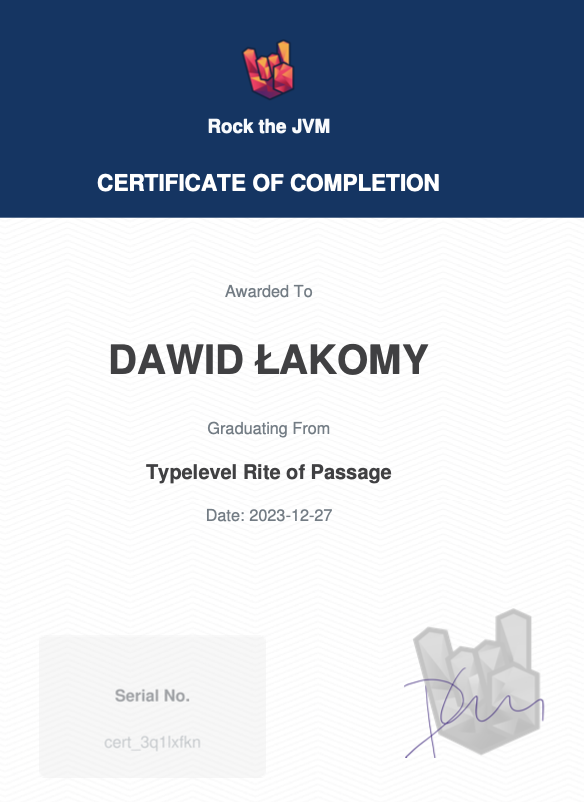

# Jobsboard

This is the effect of my participation in the course `Typelevel Rite of Passage`. It’s been a great adventure. I highly recommend this course and other fantastic content available on [rockthejvm.com](https://rockthejvm.com/) .

## How to build (dev)
In one terminal start the DB:
`docker compose up`.

In another one the server (the conf is in `server/src/main/resources/application.conf`; adjust if needed; BTW the stripe keys are for test mode, you won't get money from them 😉):
`sbt "server/run"`.

In the third one build the frontend: `sbt "app/fastOptJS"` and then `cd app && npm run start` (preceded by `npm install` if needed).

## How to build and deploy to staging

The details are described in the last chapter of the course. Here I only explain the general idea.

Build the docker image by invoking `stagingBuild / Docker / publishLocal` in `sbt` (and then save it and upload to your staging env). Adjust conf (`server/src/main/resources/staging/application.conf`) if needed and note what env variables need to be set.


Build the frontend: `sbt "app/fullOptJS"`. Then `cd app && npm run build`
and upload the contents of the `dist` directory to your staging, to the directory served by the server (eg. `/var/www/jobsboard`).

Then configure you server (`nginx`/`apache`/whatever) so that all calls to `…/api` are routed to the backend (adjust the port). Define the error page  404 so that se server responds with 200 and serves `index.html` (the app will handle the error). Eg. for nginx:

```
location /api {
    proxy_pass http://localhost:4041
}

error page 404 =200 /index.html;
```

And… run the app. Don’t forget to provide a Postgres DB with the schema described in `sql/init.sql` ;)

## My certificate 🎉

